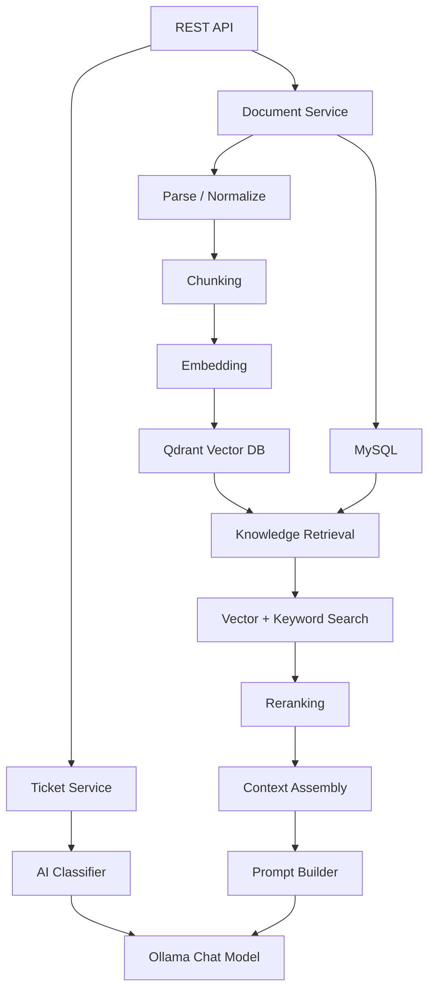
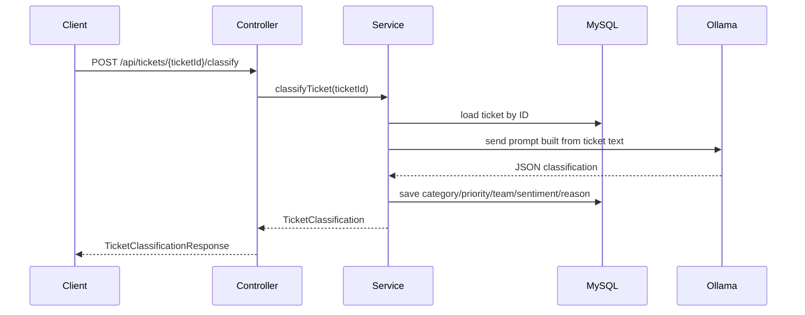
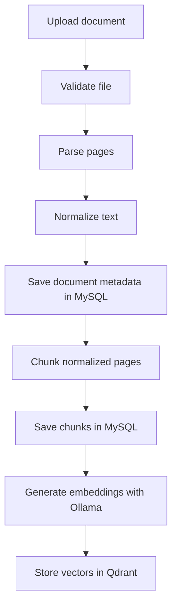
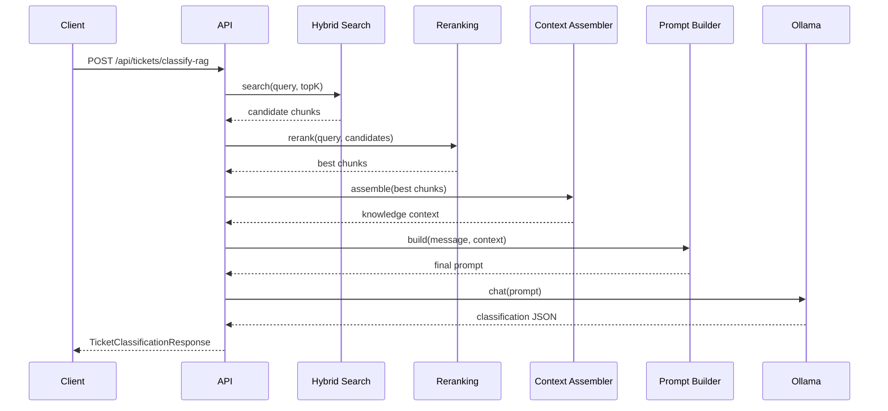

# AI Support Ticket Triage

An AI-powered Spring Boot application for support-ticket triage, document ingestion, and retrieval-augmented classification.

The project combines:

- **MySQL** for transactional data and document metadata
- **Qdrant** for vector search over knowledge chunks
- **Ollama** for both chat-based classification and text embeddings
- **Spring Boot** REST APIs for ticket classification and document ingestion

---

## Table of contents

1. [Project overview](#project-overview)
2. [Architecture](#architecture)
3. [Technologies](#technologies)
4. [Ticket classification flow](#ticket-classification-flow)
5. [Document ingestion flow](#document-ingestion-flow)
6. [RAG / retrieval flow](#rag--retrieval-flow)
7. [Database structure](#database-structure)
8. [API endpoints](#api-endpoints)
9. [Configuration](#configuration)
10. [How to run](#how-to-run)
11. [Example requests / responses](#example-requests--responses)
12. [Future improvements](#future-improvements)
13. [Learning summary](#learning-summary)

---

## Project overview

This application helps support teams automatically understand and route customer tickets.

It supports two major AI workflows:

- **Direct ticket classification**: classify a ticket using the ticket text and an LLM.
- **RAG-based classification**: retrieve relevant knowledge chunks from a vector store, build a context-rich prompt, and ask the LLM to classify using retrieved evidence.

It also includes a document ingestion pipeline that:

- accepts uploaded files,
- parses and normalizes the text,
- chunks the content,
- stores metadata in MySQL,
- stores embeddings in Qdrant for retrieval later.

---

## Architecture

### High-level architecture



### Main layers

- **Controller layer**: exposes REST endpoints.
- **Service layer**: coordinates validation, parsing, persistence, and AI calls.
- **Classification layer**: builds prompts, calls Ollama, parses LLM output.
- **Document pipeline**: validates, parses, normalizes, chunks, embeds, and stores documents.
- **Vector search layer**: performs semantic and hybrid retrieval from Qdrant.
- **Persistence layer**: uses JPA repositories for MySQL-backed entities.

---

## Technologies

- **Java 21**
- **Spring Boot 4.1.1**
- **Spring Web MVC**
- **Spring Data JPA**
- **MySQL**
- **Qdrant**
- **Ollama**
- **MapStruct**
- **Lombok**
- **Apache PDFBox**
- **Apache Tika**
- **SpringDoc OpenAPI**

---

## Ticket classification flow

### Direct classification flow



### What happens

1. The client sends a ticket ID.
2. The service loads the ticket from MySQL.
3. The AI classifier builds a prompt from the ticket message.
4. Ollama returns a JSON classification.
5. The parser validates the response.
6. The classification is written back to the ticket.
7. The API returns the classification result.

### Output fields

- `category`
- `priority`
- `team`
- `sentiment`
- `reason`

---

## Document ingestion flow

### Ingestion flow



### What happens

1. A file is uploaded to `/api/documents`.
2. The file is validated.
3. The appropriate parser is selected based on content type.
4. Pages are extracted and normalized.
5. The document metadata is stored in MySQL.
6. The normalized text is split into chunks.
7. Chunk entities are stored in MySQL.
8. Embeddings are generated and stored in Qdrant for retrieval.

### Supported storage split

- **MySQL**: document metadata, parsed text, chunk metadata, tickets, classification results.
- **Qdrant**: vector embeddings for semantic retrieval.

---

## RAG / retrieval flow

### Retrieval-Augmented Generation flow



### Why hybrid retrieval?

Hybrid retrieval combines:

- **semantic/vector search** for meaning,
- **keyword search** for exact terminology.

This improves recall and helps when the same issue can be described in different ways.

### What the RAG flow adds

Without RAG, the model only sees the ticket text.

With RAG, the model also sees relevant knowledge chunks, so it can make a more grounded classification.

---

## Database structure

### MySQL tables

#### `tickets`

Stores support tickets and AI classification output.

Key fields:

- `id` — UUID primary key
- `message` — original ticket text
- `status` — ticket state (`OPEN`, `RESOLVED`, etc.)
- `category` — AI category
- `priority` — AI priority
- `team` — assigned support team
- `sentiment` — detected customer sentiment
- `classification_reason` — explanation returned by the model
- `created_at` — creation timestamp

#### `ai_documents`

Stores uploaded document metadata and extracted content.

Key fields:

- `id` — UUID primary key
- `file_name`
- `content_type`
- `file_size`
- `raw_text`
- `normalized_text`
- `created_at`

#### `document_chunks_ai`

Stores chunk-level text for retrieval.

Key fields:

- `id` — UUID primary key
- `document_id` — links chunks back to `ai_documents`
- `chunk_index` — ordering within the document
- `page_number` — original page reference
- `text` — chunk text

### Qdrant collection

- **Collection name**: `knowledge_chunks`
- **Purpose**: stores vector embeddings of chunk text
- **Embedding dimension**: `768`

---

## API endpoints

### Ticket classification

#### `POST /api/tickets/{ticketId}/classify`

Classifies an existing ticket by ID and persists the result.

#### `POST /api/tickets/classify-rag`

Classifies a ticket message using RAG and knowledge retrieval.

### Document ingestion

#### `POST /api/documents`

Uploads and processes a document using multipart form data.

Form field:

- `file` — the uploaded document

### API documentation

The project includes SpringDoc OpenAPI support, so the Swagger UI is available when the application is running.

---

## Configuration

The main configuration lives in `src/main/resources/application.properties`.

### Important values

- **Server port**: `8099`
- **MySQL datasource**: configure your local MySQL connection
- **Multipart upload limit**: `50MB`
- **Chunk size**: `1000`
- **Chunk overlap**: `200`
- **Ollama chat model**: `llama3.2:3b`
- **Ollama embedding model**: `nomic-embed-text`
- **Embedding dimension**: `768`
- **Qdrant collection**: `knowledge_chunks`
- **RAG top-k**: `5`
- **RAG max chunks**: `8`
- **RAG max characters**: `5000`
- **Minimum retrieval similarity**: `0.55`

### Environment variables

At minimum, make sure these services are available:

- MySQL
- Qdrant
- Ollama

If you are using Qdrant Cloud, set:

- `QDRANT_API_KEY`

> Note: the committed `application.properties` contains local development values. For real deployments, move secrets into environment variables or a protected configuration store.

---

## How to run

### Prerequisites

- Java 21
- Maven 3.9+ or the Maven wrapper included in the repo
- MySQL server
- Qdrant instance
- Ollama installed and running locally

### 1) Start Ollama

Pull the required models:

```powershell
ollama pull llama3.2:3b
ollama pull nomic-embed-text
```

Make sure Ollama is running at `http://localhost:11434`.

### 2) Start MySQL

Create the database configured in `application.properties` and update credentials as needed.

### 3) Configure Qdrant

Set the Qdrant host and API key in your environment or config.

### 4) Run the application

Using Maven wrapper on Windows:

```powershell
.\mvnw.cmd spring-boot:run
```

Or build the JAR:

```powershell
.\mvnw.cmd clean package
java -jar .\target\ai-0.0.1-SNAPSHOT.jar
```

### 5) Open the app

- Application: `http://localhost:8099`
- Swagger UI: available via SpringDoc at the default Swagger endpoint

---

## Example requests / responses

### 1) Classify an existing ticket

#### Request

```http
POST /api/tickets/3fa85f64-5717-4562-b3fc-2c963f66afa6/classify
```

#### Response

```json
{
  "category": "TECHNICAL",
  "priority": "HIGH",
  "team": "TECHNICAL_SUPPORT",
  "sentiment": "FRUSTRATED",
  "reason": "The customer reports repeated login failures after a password reset, which indicates a technical authentication issue requiring urgent attention."
}
```

### 2) RAG-based classification

#### Request

```http
POST /api/tickets/classify-rag
Content-Type: application/json
```

```json
{
  "message": "I was charged twice for my subscription this month and I need a refund immediately."
}
```

#### Response

```json
{
  "category": "PAYMENT",
  "priority": "HIGH",
  "team": "BILLING_SUPPORT",
  "sentiment": "ANGRY",
  "reason": "The message describes duplicate billing and requests a refund, which is a billing issue with strong negative sentiment."
}
```

### 3) Upload a document

#### Request

```http
POST /api/documents
Content-Type: multipart/form-data
```

Form field:

- `file`: `knowledge-base.pdf`

#### Response

```json
{
  "id": "2c5f3b8b-3c83-4d0d-96e8-2f2d8a8e8b11",
  "fileName": "knowledge-base.pdf",
  "contentType": "application/pdf",
  "fileSize": 248931,
  "extractedTextLength": 13452,
  "normalizedTextLength": 12890,
  "createdAt": "2026-09-22T10:15:30"
}
```

---

## Future improvements

- Add ticket creation and listing endpoints.
- Add document search endpoints for manual retrieval and debugging.
- Externalize all secrets and infrastructure settings into environment variables.
- Add asynchronous background processing for document ingestion.
- Add retry and circuit-breaker policies for Ollama and Qdrant calls.
- Add audit logging for classification and ingestion events.
- Expand test coverage for edge cases around parsing, chunking, and retrieval fallback.
- Improve observability with metrics and tracing.

---

## Learning summary

### What is an embedding?

An embedding is a numeric vector representation of text.
It captures meaning in a way that machines can compare mathematically.

### What is chunking?

Chunking means splitting a large document into smaller pieces so each piece can be searched and embedded effectively.

### Why do we need a vector database?

A vector database stores embeddings and makes similarity search fast. It is useful when you want to find text by meaning instead of only by exact words.

### What is semantic search?

Semantic search finds text that means something similar to the query, even if the exact words are different.

### What is keyword search?

Keyword search finds text that contains exact terms or phrases from the query.

### Why hybrid retrieval?

Hybrid retrieval combines semantic search and keyword search so the system can catch both conceptual matches and exact matches.

### What is RAG?

RAG stands for Retrieval-Augmented Generation.
It means the model receives relevant retrieved knowledge before generating an answer or classification.

### What belongs in MySQL?

MySQL stores structured and transactional data:

- tickets
- document metadata
- chunk metadata
- classification results

### What belongs in Qdrant?

Qdrant stores the vector embeddings used for similarity search over document chunks.

### What does the LLM actually do?

The LLM reads the prompt and returns the most likely classification plus a short explanation
In this project, Ollama hosts that model locally or remotely.

### Why validate LLM output?

LLM output can be malformed, incomplete, or inconsistent.
Validation protects the application from bad responses and makes failures easier to debug.

### What happens when retrieval finds nothing?

If retrieval returns no relevant chunks, the system should continue safely with an empty or minimal context.
That way the classifier can still respond, but without extra knowledge support.

---

## Notes

- The current codebase uses a layered architecture, with clear separation between controllers, services, persistence, retrieval, and AI integration.
- Document ingestion is designed to support future knowledge-base expansion.
- RAG improves classification quality when the ticket depends on policy, troubleshooting, or domain-specific guidance.

